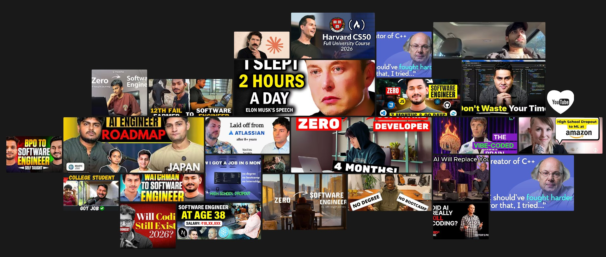

## Video-gallry 

One of my favorite projects was when I was learning CSS Grid. Understand how CSS Grid works in two dimensions. While searching on Google I found a photo gallery made with CSS Grid. Convert the photo galary to all my favorite YouTube videos that have helped me on my journey to becoming a software engineer. Click any of the img that redirect to [youtube](https://www.youtube.com ).

- HTML
- CSS <b>Grid</b>
- javaScript

Made with ❤️ google and stackoverflow